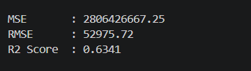
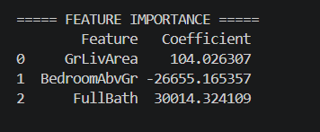
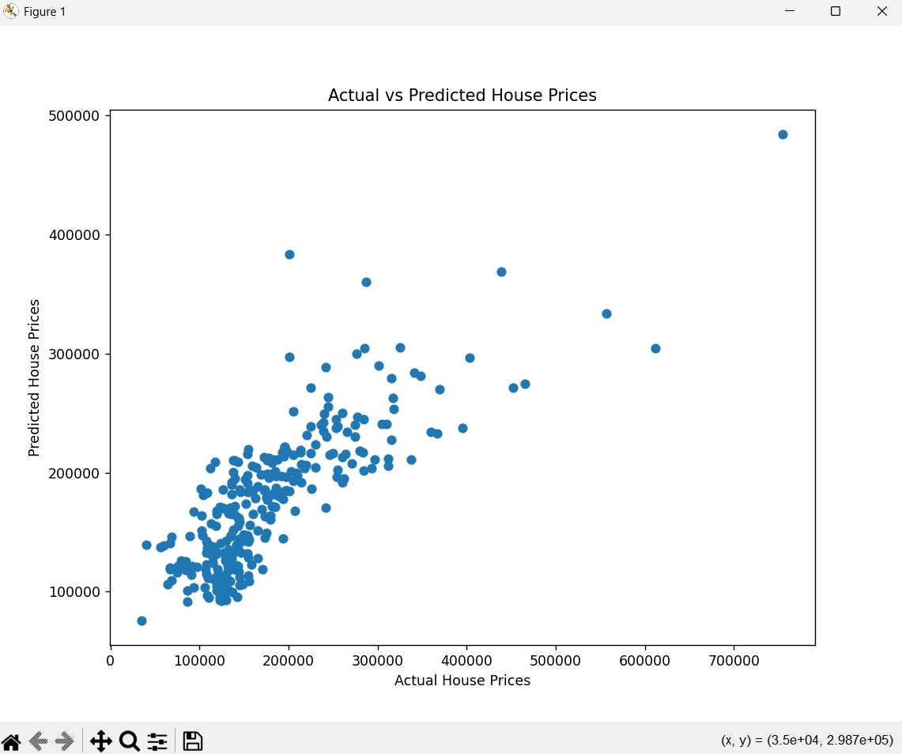

# House Price Prediction using Linear Regression

## 📌 Project Overview

This project was developed as part of the **Machine Learning Internship at SkillCraft Technology**.

The objective is to build a **Linear Regression model** that predicts house prices based on:

- Living Area (GrLivArea)
- Number of Bedrooms (BedroomAbvGr)
- Number of Bathrooms (FullBath)

The model is trained using the Kaggle House Prices dataset and evaluated using standard regression metrics.

---

## 🎯 Task Objective

Implement a Linear Regression model to predict house prices based on house characteristics such as area, bedrooms, and bathrooms.

---

## 🛠️ Technologies Used

- Python
- Pandas
- NumPy
- Matplotlib
- Scikit-Learn

---

## 📂 Dataset

Dataset: House Prices - Advanced Regression Techniques

Files Used:

- train.csv
- test.csv

Target Variable:

- SalePrice

Selected Features:

- GrLivArea (Ground Living Area)
- BedroomAbvGr (Bedrooms Above Ground)
- FullBath (Full Bathrooms)

---

## 🤖 Machine Learning Model

### Linear Regression

Linear Regression is a supervised machine learning algorithm used to predict continuous numerical values.

The model learns the relationship between house features and house prices and uses this relationship to make predictions.

---

## 📊 Model Evaluation

Evaluation Metrics:

| Metric | Value |
|----------|----------|
| RMSE | 52975.72 |
| R² Score | 0.6341 |

### Interpretation

- The model explains approximately **63.41%** of the variance in house prices.
- Living area and number of bathrooms have a positive impact on house prices.
- The model successfully predicts house prices using the selected features.

---

## 📈 Feature Importance

| Feature | Coefficient |
|----------|----------|
| GrLivArea | 104.03 |
| BedroomAbvGr | -26655.17 |
| FullBath | 30014.32 |

---

## 📷 Project Screenshots

### Model Evaluation Metrics



### Feature Importance



### Actual vs Predicted House Prices



---

## 📁 Project Structure

SCT_ML_1/

├── images/

│   ├── model_evaluation_metrics.png

│   ├── feature_importance.png

│   └── actual_vs_predicted_house_prices.png

├── train.csv

├── test.csv

├── sample_submission.csv

├── house_price_prediction.py

├── house_price_prediction.png

└── README.md

---

## 🚀 How to Run

### Install Required Libraries

```bash
pip install pandas numpy matplotlib scikit-learn
```

### Run the Project

```bash
python house_price_prediction.py
```

---

## 📊 Output

The model generates:

- Predicted house prices
- Model evaluation metrics
- Feature importance values
- Actual vs Predicted scatter plot

---

## 📚 Learning Outcomes

- Data Preprocessing
- Feature Selection
- Linear Regression
- Regression Metrics
- Model Evaluation
- Data Visualization

---

## 🏢 Internship

Completed as **Task 01** of the **Machine Learning Internship at SkillCraft Technology**.

---

## 👨‍💻 Author

**Roopesh Chalasani**

Machine Learning Intern

SkillCraft Technology
